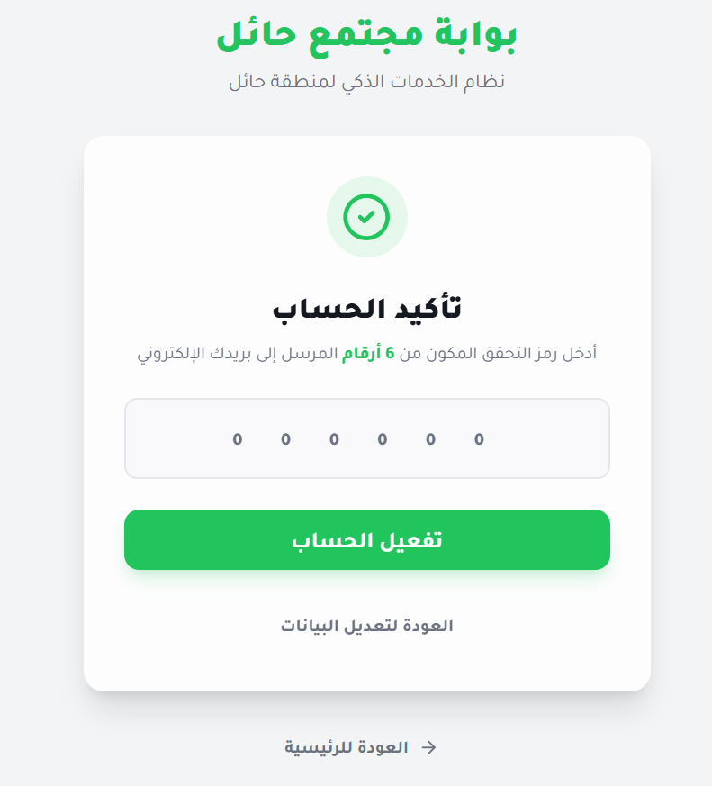
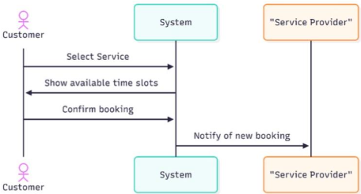
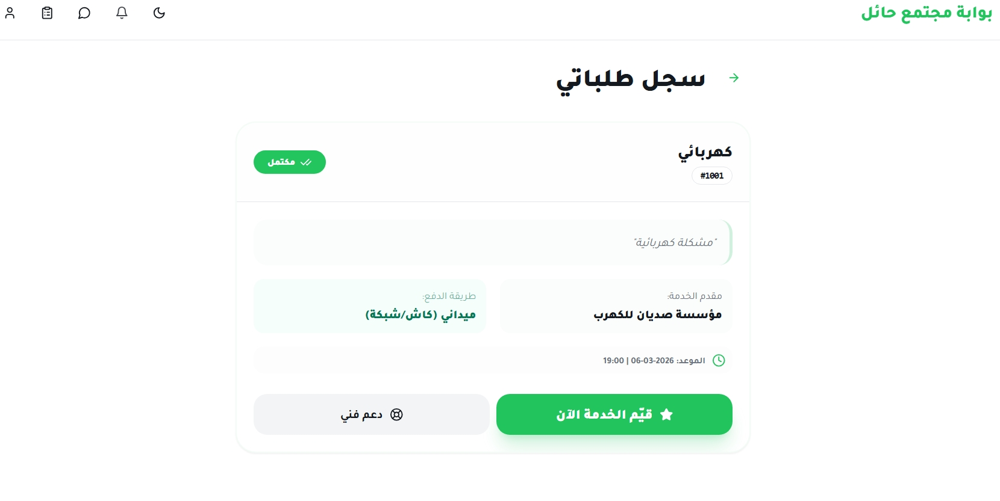
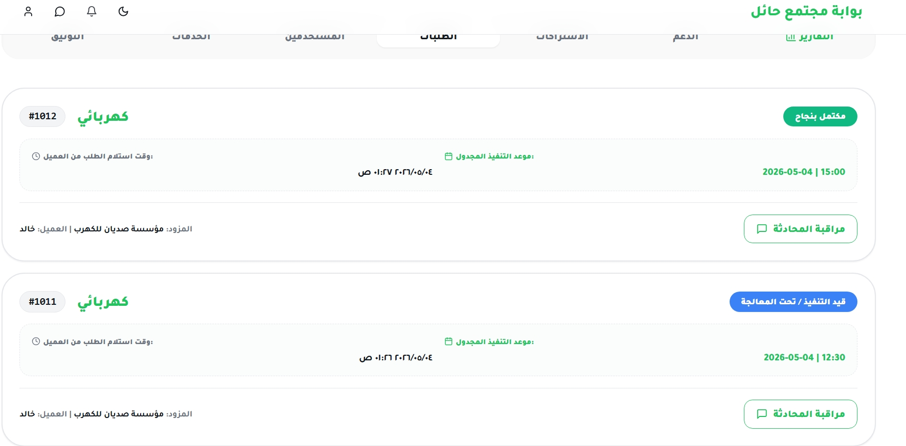
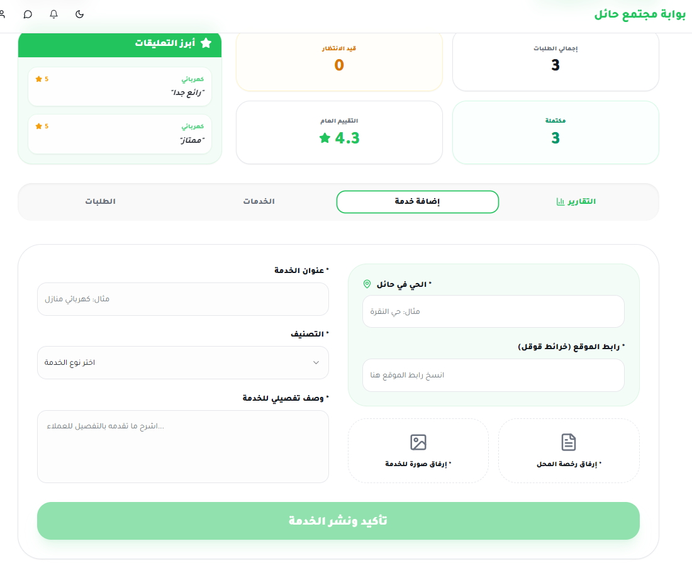
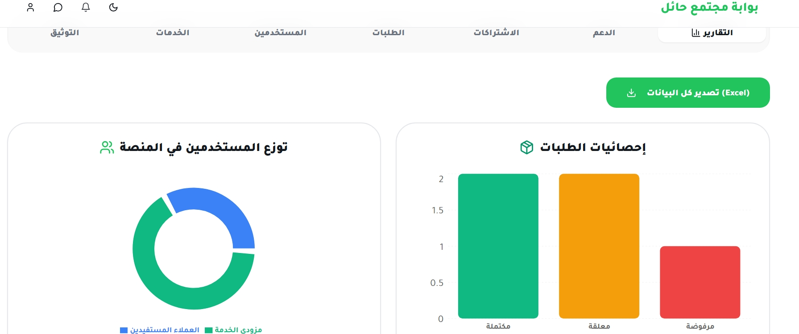
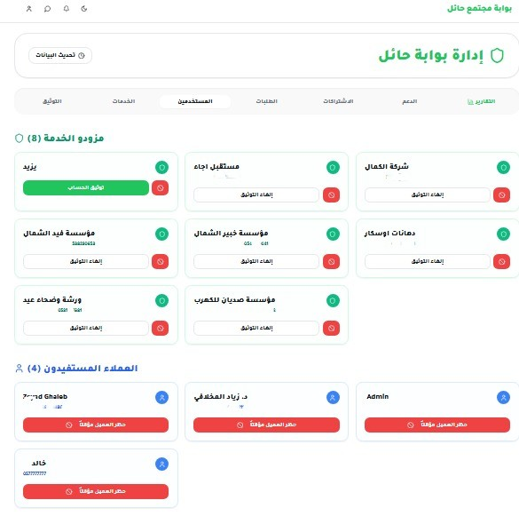
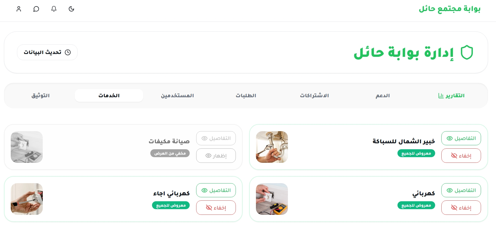
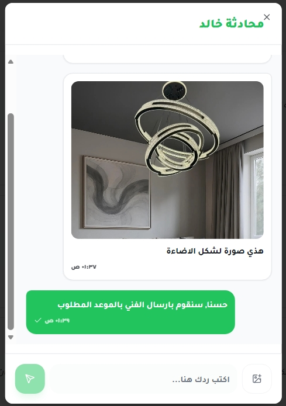

# Hail Community Portal

> A full-stack digital marketplace connecting clients with local service providers across the Hail region, Saudi Arabia.

Developed as a graduation capstone project for the **Bachelor of Computer Science and Information Systems** program at the **University of Hail**.

🔗 **Live Demo:** [hail-community-portal.vercel.app](https://hail-community-portal.vercel.app/)

---

## Table of Contents

- [Project Overview](#project-overview)
- [Key Features](#key-features)
- [Technology Stack](#technology-stack)
- [System Preview](#system-preview)
- [Getting Started](#getting-started)
- [Environment Variables](#environment-variables)
- [Project Team](#project-team)
- [License](#license)

---

## Project Overview

Hail Community Portal is a role-based web platform that connects clients with service providers through a secure and scalable digital ecosystem.

The platform enables users to:
- Discover and book local services
- Communicate with providers in real time
- Manage transactions through dedicated role-based dashboards

It also includes a full administrative system for service moderation, user management, and platform analytics.

---

## Key Features

### 👤 Client Portal
- Browse and search service categories
- View provider profiles and service details
- Submit service requests and bookings
- Real-time messaging with providers
- Ratings and reviews system
- Order tracking and history

### 🛠️ Provider Workspace
- Create, edit, and manage services
- Handle incoming customer requests
- Real-time communication with clients
- Performance analytics dashboard
- Subscription and trial management
- Support ticket system

### 🔧 Administrator Dashboard
- Service approval and moderation workflow
- User verification and account management
- Platform analytics and statistics
- Support ticket oversight
- Subscription monitoring
- Data export functionality

### ⚙️ Technical Highlights
- Role-Based Access Control (RBAC)
- Real-Time Messaging via Supabase Realtime
- Secure Authentication with MFA support
- PostgreSQL database architecture
- Responsive, mobile-first design
- Analytics dashboards with data visualization
- Cloud storage integration
- Secure deployment pipeline (Vercel)

---

## Technology Stack

| Layer | Technologies |
|---|---|
| **Frontend** | React.js, TypeScript, Vite |
| **UI & Styling** | Tailwind CSS, shadcn/ui |
| **Backend** | Supabase (PostgreSQL, Auth, Realtime) |
| **Data Visualization** | Recharts |
| **Deployment** | Vercel |

---

## System Preview

### Authentication


### Client Experience



### Provider Dashboard



### Admin Control Panel




### Real-Time Communication


> Additional screenshots are available in the `/public/screenshots` folder, covering authentication & onboarding, admin dashboard & moderation tools, provider management, client booking & messaging flow, and the support ticket system.

---

## Getting Started

### Prerequisites
- Node.js (v18 or higher recommended)
- A Supabase project with URL and API key

### Installation

```bash
# Clone the repository
git clone https://github.com/y9yz/hail-community-portal.git

# Navigate into the project directory
cd hail-community-portal

# Install dependencies
npm install

# Start the development server
npm run dev
```

---

## Environment Variables

Create a `.env` file in the project root with the following:

```env
VITE_SUPABASE_URL=your_supabase_url
VITE_SUPABASE_PUBLISHABLE_KEY=your_supabase_key
```

These are required to connect the application to Supabase services.

---

## Project Team

### 👨‍💻 Lead Full-Stack Developer

**Yazeed Muteb AlShammari**

Responsible for system architecture, database design, frontend development, backend integration, authentication system, real-time communication, dashboard development, and deployment (Vercel).

### Team Members

| Name | Role |
|---|---|
| Fawaz Ziyad Aluyd | Testing, feedback & requirements validation |
| Hamad Nabil Almutairi | Testing, feedback & requirements validation |
| Tariq Mohammed Alshammari | Testing, feedback & requirements validation |
| Mohammed Saadi Alrashidi | Testing, feedback & requirements validation |

### Academic Supervisor

**Dr. Zeyad Ghaleb Al-Mekhlaf**
University of Hail

---

## License

This project was developed for academic and educational purposes as part of the graduation requirements at the **University of Hail**.